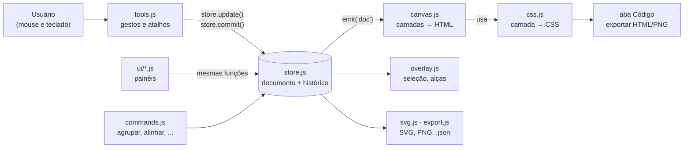

# Projeto Designer

**Um editor de design que roda no seu computador, feito só com JavaScript — e onde o canvas é CSS de verdade.**

Funciona como Figma e Penpot (frames, camadas, auto layout, componentes, protótipo), mas com uma diferença que dá nome ao projeto: cada camada que você desenha é um elemento HTML estilizado pelo próprio navegador. Por isso o que você vê no editor é **exatamente** o que o CSS faz, o painel de código mostra o CSS real, e "auto layout" não é uma imitação: é `display: flex` e `display: grid`.


> **Em uma frase:** abra o app, desenhe uma tela, e copie o CSS/HTML dela. Sem conta, sem internet obrigatória, sem instalar dependências.

---

## Índice

1. [O que é e o que não é](#1-o-que-é-e-o-que-não-é)
2. [Veja o produto](#2-veja-o-produto)
3. [Começando em 3 minutos](#3-começando-em-3-minutos)
4. [Primeiros passos no editor](#4-primeiros-passos-no-editor)
5. [Referência de funcionalidades](#5-referência-de-funcionalidades)
6. [Atalhos de teclado](#6-atalhos-de-teclado)
7. [Como funciona por dentro](#7-como-funciona-por-dentro)
8. [Estrutura do repositório](#8-estrutura-do-repositório)
9. [Testes](#9-testes)
10. [Desempenho](#10-desempenho)
11. [Limitações (leia antes de usar em trabalho sério)](#11-limitações-leia-antes-de-usar-em-trabalho-sério)
12. [Contribuindo](#12-contribuindo)
13. [Inspiração e licença](#13-inspiração-e-licença)

---

## 1. O que é e o que não é

**É:**
- Um editor de design vetorial/UI **local**: abre no navegador, salva no próprio navegador e em arquivo `.json`.
- **JavaScript puro** (módulos ES), **sem TypeScript, sem framework, sem etapa de build, sem dependências**. O servidor incluído é opcional e tem menos de 40 linhas de código.
- Uma ferramenta para **estudar e prototipar com CSS**: os campos do painel têm os nomes das propriedades (`gap`, `padding`, `justify-content`, `align-items`, `mix-blend-mode`...), então usar o editor ensina o CSS.

**Não é:**
- Um substituto completo do Figma ou do Penpot. Faltam operações booleanas, variantes de componentes, variáveis/temas, colaboração em tempo real e plugins (lista completa na [seção 11](#11-limitações-leia-antes-de-usar-em-trabalho-sério)).
- Uma ferramenta "pronta para equipe": o projeto fica no seu navegador e/ou em arquivo; não há nuvem.

---

## 2. Veja o produto

Cada imagem abaixo é uma captura real do app (geradas por [`scripts/gerar-capturas.mjs`](scripts/gerar-capturas.mjs)). O projeto de exemplo "app mobile" está em **Arquivo → Exemplo: app mobile**.

### Auto layout é flexbox de verdade
Selecione um frame, escolha o modo (linha, coluna, grid) e use a **matriz 3×3** para alinhar. Os campos são o CSS: `gap`, `padding`, `justify-content`, `align-items`. Camadas filhas escolhem **Fixo**, **Ajustar ao conteúdo** (`hug`) ou **Preencher** (`flex: 1`).


### CSS Grid
O mesmo painel liga `display: grid`: número de colunas e linhas, `column-gap`/`row-gap`, e cada item pode ocupar várias células (`grid-column: span N`).


### Componentes e estilos
Crie um **componente** (Ctrl+Alt+K) e insira **instâncias**. Mudou o principal, todas as instâncias mudam — mas o texto ou a cor que você personalizou numa instância continua lá. A aba **Recursos** lista componentes e **estilos** de cor e de texto compartilhados.


### O CSS real, pronto para copiar
A aba **Código** mostra o CSS e o HTML da seleção (ou da página inteira). É a mesma função que desenha o canvas e exporta o HTML, então não existe diferença entre o que você vê e o que copia.


### Protótipo navegável
Na aba **Protótipo**, defina "ao clicar / ao passar o mouse → navegar para um frame, voltar ou abrir um link", com transições. As **setas de fluxo** aparecem no canvas, e o botão **Apresentar** abre em tela cheia.


### Vetores com a caneta
Curvas de Bézier: clique e arraste para criar pontos suaves com alças; duplo clique num vetor para **editar os pontos** (arrastar pontos e alças, `Alt` + clique adiciona ponto, duplo clique alterna canto/suave). Polígono e estrela viram vetores editáveis.


### Medidas, réguas, guias e grades
Segure **Alt** e passe o mouse sobre outra camada para ver as **distâncias**. Arraste das **réguas** para criar guias (o snap as enxerga). Cada frame pode ter **grades de layout** de colunas, linhas ou quadrícula.


### Tema claro/escuro e efeitos
Gradientes, sombras múltiplas, `filter: blur`, **vidro fosco** (`backdrop-filter`), contorno tracejado, `mix-blend-mode`... tudo com os valores do CSS.


---

## 3. Começando em 3 minutos

### O que você precisa
- **Node.js 18 ou mais novo** ([nodejs.org](https://nodejs.org)). Não há nada para `npm install`.
- Um navegador atual (Chrome, Edge, Firefox ou Safari).

> **Por que preciso de um servidor?** O app usa módulos ES (`import ... from`), e o navegador não os carrega abrindo o `index.html` direto do disco (`file://`). O `server.js` entrega os arquivos em `http://localhost` e mais nada.

### Rodando

```bash
git clone https://github.com/Kaykygnb/projetodesigner2.git
cd projetodesigner2
npm start
```

Abra **http://localhost:5173**. Para usar outra porta: `PORT=8080 npm start`.

### Sem Node? Tudo bem

Qualquer servidor de arquivos estáticos serve. Por exemplo, com Python:

```bash
python3 -m http.server 8000     # depois abra http://localhost:8000
```

### Publicar como site (GitHub Pages)
Como o app é 100% estático, dá para hospedar de graça: no GitHub, **Settings → Pages → Deploy from a branch → `main` / `/ (root)`**. O app abre em `https://SEU-USUARIO.github.io/projetodesigner2/`.

### Onde meu trabalho fica salvo?
- **Automaticamente** no `localStorage` do seu navegador (o topo mostra *Salvando… / Salvo*).
- **Se você limpar os dados do site, trocar de navegador ou de porta, perde.** Para guardar de verdade use **Arquivo → Salvar projeto (.json)** (ou `Ctrl+S`) e **Arquivo → Abrir arquivo** para voltar.

---

## 4. Primeiros passos no editor

Um roteiro de 5 minutos para sentir o app. (Dica: **Arquivo → Exemplo: app mobile** abre um projeto pronto para explorar.)

1. **Desenhe um frame** — aperte `F` e arraste no canvas. Frames são as "telas".
2. **Desenhe dentro dele** — `R` retângulo, `E` elipse, `T` texto (clique e digite). O frame sob o cursor vira o pai da camada nova.
3. **Mova e redimensione** — `V` volta à ferramenta Mover. Arraste a camada (linhas rosa mostram o *snap*), puxe as alças para redimensionar (`Shift` mantém a proporção, `Alt` redimensiona do centro). Passe o mouse fora de um canto para **rotacionar**.
4. **Ligue o auto layout** — selecione o frame e aperte `Shift+A`. O app deduz direção, `gap` e `padding` a partir de onde as camadas estavam. Agora arraste uma camada: ela **reordena** dentro do flexbox.
5. **Veja o CSS** — abra a aba **Código** no painel direito.
6. **Desfaça sem medo** — `Ctrl+Z` desfaz o gesto inteiro (um arrasto é um passo só).
7. **Exporte** — painel Design → **Exportar**: PNG, SVG ou HTML; ou `Ctrl+S` para salvar o projeto.

---

## 5. Referência de funcionalidades

### Ferramentas
| Ferramenta | Atalho | O que faz |
|---|---|---|
| Mover | `V` | Seleciona, move, redimensiona, rotaciona. |
| Frame | `F` ou `B` | Desenha uma prancha/contêiner. Tem presets de tamanho (iPhone, Android, iPad, Desktop, A4, Story...). |
| Retângulo / Elipse | `R` / `E` | Formas básicas. Um clique sem arrastar cria 100×100. |
| Linha | `L` | Linha com ângulo livre (`Shift` prende em múltiplos de 15°). |
| Polígono / Estrela | botão da barra | Viram vetores editáveis. |
| Caneta | `P` | Vetores com curvas de Bézier. |
| Texto | `T` | Clique para texto livre; arraste para uma caixa de largura fixa. |
| Imagem | botão, arrastar ou `Ctrl+V` | Cria um retângulo com preenchimento de imagem (reduzida a 1600 px para caber no armazenamento). |
| Mão | `H` ou segurar `Espaço` | Arrasta a vista. |

### Seleção e edição
| Recurso | Como |
|---|---|
| Selecionar | Clique; `Shift`+clique soma; arraste no vazio faz *marquee*; `Ctrl`+clique atravessa grupos; `Tab`/`Shift+Tab` percorrem as camadas. |
| Mover | Arraste; setas movem 1 px (`Shift` = 10 px); `Alt`+arrastar duplica; arrastar sobre outro frame **troca o pai**. |
| Alinhar / distribuir | Barra no topo do painel Design (esquerda, centro, direita, topo, meio, base; distribuir com 3+ camadas). |
| Várias camadas | O painel mostra **X/Y/W/H do conjunto** e escala todas juntas. |
| Agrupar | `Ctrl+G` agrupa; `Ctrl+Shift+G` desagrupa (também frames); `Ctrl+Alt+G` **envolve em frame**. |
| Máscara | `Ctrl+Alt+M`: a camada de baixo recorta as outras (`clip-path`). |
| Ordem (z) | `Ctrl+]` / `Ctrl+[` (um passo); com `Shift`, frente/fundo. |
| Copiar/colar | `Ctrl+C/X/V`; com **um frame selecionado**, cola dentro dele. Cola também imagem ou texto do sistema. |
| Copiar propriedades | `Ctrl+Alt+C` / `Ctrl+Alt+V` leva só a aparência (cor, borda, sombra...). |
| Travar / ocultar | Ícones na lista de camadas; `Ctrl+Shift+L` / `Ctrl+Shift+H`. |
| Espelhar | `Shift+H` / `Shift+V`. |
| Travar proporção | Botão de corrente ao lado de W/H. |
| Desfazer / refazer | `Ctrl+Z` / `Ctrl+Shift+Z` (até 200 passos). |

### Layout (o coração do projeto)
| Recurso | Detalhe |
|---|---|
| **Flexbox** | `flex-direction` (linha/coluna), `gap`, `padding` (horizontal/vertical ou por lado), `justify-content`, `align-items`, `flex-wrap`. |
| **CSS Grid** | Colunas, linhas, `column-gap`/`row-gap`; itens podem ocupar várias células (`grid-column: span N`). |
| Matriz 3×3 | Define `justify` e `align` de uma vez; troca de papel entre linha e coluna. |
| Tamanho do item | **Fixo**, **Ajustar ao conteúdo** (`hug`) ou **Preencher** (`flex: 1` / `align-self: stretch`). |
| Posição absoluta | Marque "Posição absoluta" para um item **ignorar** o auto layout do pai (enfeites, selos). |
| Constraints | Em frames **sem** auto layout: esquerda, direita, esquerda+direita, centro, escala (e o mesmo na vertical). Reagem ao redimensionar o frame. |
| Grades de layout | Colunas, linhas ou quadrícula por frame (só guia visual). |
| Réguas e guias | `Shift+R` liga/desliga; arraste da régua para criar; arraste de volta para apagar. |

### Aparência
| Recurso | Detalhe |
|---|---|
| Preenchimento | Nenhum, cor sólida, gradiente linear (com ângulo), radial, imagem (`cover`/`contain`/esticar). Várias paradas de cor. |
| Contorno | Cor, espessura, sólido/tracejado/pontilhado, dentro/centro/fora (usa `outline`, que não altera o layout). |
| Cantos | `border-radius` único ou por canto. |
| Sombras | Várias, externas e internas (`box-shadow`); em texto vira `text-shadow`; em vetor, `drop-shadow`. |
| Efeitos | `filter: blur`, **desfoque de fundo** (`backdrop-filter`, efeito vidro), opacidade, `mix-blend-mode` (16 modos). |
| Texto | Fonte, peso, tamanho, `line-height`, `letter-spacing`, alinhamento, itálico, sublinhado/riscado, MAIÚSCULAS/minúsculas, alinhamento vertical na caixa, gradiente no texto. Durante a edição: `Ctrl+B/I/U`. |
| Cores do projeto | Atalhos com as cores já usadas, e conta-gotas (onde o navegador oferece). |

### Biblioteca
| Recurso | Detalhe |
|---|---|
| Componentes | `Ctrl+Alt+K` cria o principal; **instâncias** seguem o principal mas mantêm sobrescritas (texto, cor, tamanho...). `Ctrl+Alt+B` desanexa; "Ir ao principal" navega até ele. |
| Estilos de cor e de texto | Criados da seleção (aba Recursos ou botão **+**). Mudar o estilo muda todas as camadas ligadas. |
| Páginas | Várias por projeto; botão direito na página: renomear, **duplicar**, excluir. |

### Protótipo
Gatilhos **ao clicar** e **ao passar o mouse**; ações **navegar para**, **voltar** e **abrir link**; transições **instantâneo, dissolver e deslizar** (4 direções); ponto de partida do fluxo; setas no canvas; **Apresentar** em tela cheia (`Ctrl+Alt+Enter`; `Esc` sai, `R` reinicia).

### Código e exportação
| Saída | Como | Observação |
|---|---|---|
| **CSS e HTML** | Aba **Código** (ou `Ctrl+Shift+C` para copiar o CSS) | A mesma função do canvas; classes legíveis (`.cartao-de-saldo`). |
| **PNG** | Painel → Exportar (1x a 4x); **Arquivo → Exportar todos os frames** | Usa as fontes **instaladas** no seu computador e pode não mostrar `backdrop-filter`. |
| **SVG** | Painel → Exportar | Vetorial de verdade (formas, textos, gradientes, sombras, máscaras). Sombras internas e vidro não existem em SVG e são omitidos. |
| **HTML** | Painel → Exportar | Página completa, um arquivo só. |
| **Projeto (.json)** | `Ctrl+S` | Páginas, imagens e estilos. Abrir: `Ctrl+O`. |

### Conforto de uso
Painéis **redimensionáveis** (arraste a borda; duplo clique restaura) · **modo foco** `Ctrl+\` esconde os painéis · busca de camadas · grade de pixels a partir de 800% de zoom · indicador *Salvo* · aviso amigável se algo inesperado acontecer.

---

## 6. Atalhos de teclado

No app, aperte **`?`** para ver esta lista. (No Mac, use `⌘` no lugar de `Ctrl`.)

| Área | Atalho | Ação |
|---|---|---|
| **Ferramentas** | `V` · `F`/`B` · `R` · `E` · `L` · `P` · `T` · `H` | Mover · Frame · Retângulo · Elipse · Linha · Caneta · Texto · Mão |
| **Edição** | `Ctrl+Z` / `Ctrl+Shift+Z` | Desfazer / Refazer |
| | `Ctrl+D` · `Alt`+arrastar | Duplicar |
| | `Ctrl+C` / `X` / `V` | Copiar / Recortar / Colar |
| | `Ctrl+A` | Selecionar tudo no mesmo nível |
| | `Delete` | Excluir |
| | Setas (`Shift` = 10 px) | Mover |
| | `0`–`9` | Opacidade (1 = 10% … 0 = 100%) |
| **Agrupar e layout** | `Ctrl+G` / `Ctrl+Shift+G` | Agrupar / Desagrupar |
| | `Ctrl+Alt+G` | Envolver em frame |
| | `Shift+A` | Auto layout (liga/desliga ou envolve a seleção) |
| | `Ctrl+Alt+M` | Máscara |
| | `Shift+H` / `Shift+V` | Espelhar |
| **Componentes** | `Ctrl+Alt+K` / `Ctrl+Alt+B` | Criar componente / Desanexar |
| | `Ctrl+Alt+C` / `Ctrl+Alt+V` | Copiar / colar propriedades |
| **Camadas** | `Ctrl+]` / `Ctrl+[` | Avançar / Recuar |
| | `Ctrl+Shift+]` / `Ctrl+Shift+[` | Frente / Fundo |
| | `Ctrl+Shift+L` / `Ctrl+Shift+H` | Travar / Ocultar |
| | `F2` | Renomear |
| | `Enter` / `Shift+Enter` | Entrar no grupo / sair para o pai |
| **Seleção** | `Ctrl`+clique | Seleciona através de grupos |
| | `Tab` / `Shift+Tab` | Próxima / anterior camada |
| | `Alt`+mouse | Mostra distâncias até outra camada |
| **Vista** | `Ctrl`+roda · `Ctrl`+`+`/`-`/`0` | Zoom · Aproximar/afastar/100% |
| | Roda · `Shift`+roda | Rolar vertical / horizontal |
| | `Espaço`+arrastar | Pan |
| | `Shift+1` / `Shift+2` / `Shift+0` | Ajustar tudo / seleção / 100% |
| | `Shift+R` | Réguas |
| | `Ctrl+\` | Esconder/mostrar painéis |
| **Ao arrastar** | `Shift` / `Alt` / `Ctrl` | Mantém proporção (ou trava eixo) / do centro / sem *snap* |
| **Texto (editando)** | `Ctrl+B` / `I` / `U` | Negrito / itálico / sublinhado |
| **Arquivo** | `Ctrl+S` / `Ctrl+O` | Salvar / abrir projeto |
| | `Ctrl+Shift+C` | Copiar CSS |
| | `Ctrl+Alt+Enter` | Apresentar o protótipo |

---

## 7. Como funciona por dentro

O desenho em uma imagem:



Os pontos que mais importam:

1. **Tudo é dado simples.** O documento é `páginas → árvore de camadas` em objetos JSON ([`src/model.js`](src/model.js)). Isso permite salvar com `JSON.stringify`, testar sem navegador e fazer histórico por "fotos".
2. **Uma função só gera o CSS.** [`nodeStyle()`](src/css.js) converte uma camada em CSS; o canvas, o painel Código, o HTML exportado e o PNG usam a mesma. Por isso não há diferença entre editor e saída.
3. **O navegador faz o layout.** Em auto layout, quem calcula posições é o motor CSS. O editor *lê* o resultado do DOM ([`canvas.js`](src/canvas.js)) em vez de reimplementar flexbox/grid.
4. **Gesto = um passo de histórico.** Durante um arrasto o documento muda ao vivo sem histórico; ao soltar o mouse há **um** `commit()`. Um `Ctrl+Z` desfaz o gesto inteiro.
5. **Instâncias de componente guardam uma "foto base".** A cada commit o app compara a instância com a foto para descobrir o que o usuário sobrescreveu, reconstrói a partir do principal e reaplica as sobrescritas ([`components.js`](src/components.js)).

Para o aprofundamento (modelo de dados campo a campo, algoritmos, como estender o editor) leia **[`docs/ARQUITETURA.md`](docs/ARQUITETURA.md)**. O código inteiro é comentado em português, explicando o *porquê* de cada decisão.

---

## 8. Estrutura do repositório

```
projetodesigner2/
├── index.html              Página única: só o "esqueleto" (o app é montado por src/main.js)
├── server.js               Servidor estático opcional (sem dependências), só serve o app
├── package.json            Scripts: `npm start` e `npm test`
├── README.md               Este arquivo
├── CONTRIBUTING.md         Como contribuir e a convenção de commits
├── CHANGELOG.md            O que mudou em cada versão
├── docs/
│   ├── ARQUITETURA.md      Funcionamento interno e guia para estender
│   └── screenshots/        As capturas de tela usadas aqui
├── scripts/
│   └── gerar-capturas.mjs  Regenera as capturas (usa Playwright)
├── src/
│   ├── main.js             Ponto de entrada: monta o app
│   ├── model.js            Modelo de dados e funções puras da árvore
│   ├── css.js              Camada → CSS / HTML / SVG (puro)
│   ├── store.js            Estado, histórico (desfazer) e salvamento
│   ├── components.js       Componentes, instâncias e estilos (puro)
│   ├── canvas.js           Desenha o documento em HTML; pan, zoom e geometria
│   ├── overlay.js          Seleção, alças, guias, medidas, setas
│   ├── tools.js            Mouse e teclado: todos os gestos e atalhos
│   ├── commands.js         Agrupar, duplicar, alinhar, auto layout, componentes...
│   ├── pen.js              Ferramenta caneta e edição de pontos
│   ├── rulers.js           Réguas e guias
│   ├── present.js          Modo Apresentar (protótipo)
│   ├── svg.js              Exportação SVG (puro)
│   ├── export.js           PNG, SVG, HTML e arquivo de projeto
│   ├── sample.js           Os dois projetos de exemplo
│   ├── ui/                 Painéis: camadas, propriedades, código, recursos, protótipo, menus, ícones
│   └── styles/app.css      Todo o visual (tema claro/escuro por variáveis CSS)
└── tests/
    ├── css.test.js         Testes unitários do gerador de CSS e do modelo
    ├── features.test.js    Testes unitários de componentes, SVG, vetores, constraints...
    └── e2e/                Testes de navegador (opcionais, usam Playwright)
```

---

## 9. Testes

### Testes unitários (rápidos, sem navegador)
Cobrem a lógica pura: geração de CSS, modelo, constraints, componentes e instâncias, estilos, SVG, vetores, medidas e os exemplos.

```bash
npm test      # 30 testes
```

### Testes de navegador (opcionais)
Abrem o app de verdade e simulam o uso: desenhar, arrastar entre frames, redimensionar com rotação, caneta, componentes, protótipo, atalhos, desempenho. Não fazem parte das dependências do projeto:

```bash
npm i --no-save playwright && npx playwright install chromium
npm start                                  # em outro terminal
node tests/e2e/basico.mjs                  # cada arquivo imprime PASS/FAIL e "ALL PASS"
```

Detalhes e variáveis de ambiente em [`tests/e2e/README.md`](tests/e2e/README.md).

---

## 10. Desempenho

Medido movendo uma camada com o mouse num documento grande (tempo por movimento, em milissegundos; o ideal é abaixo de ~16 ms para 60 quadros por segundo):

| Camadas no projeto | Antes da otimização | Atual |
|---|---|---|
| 100 | 55 ms | ~17 ms |
| 400 | 150 ms | ~20 ms |
| 1000 | 350 ms | ~33 ms |

O ganho veio de não reconstruir a lista de camadas nem o índice interno quando só um *valor* muda. Reproduza com `node tests/e2e/desempenho.mjs 400`. A máquina de teste importa; seus números podem variar.

---

## 11. Limitações (leia antes de usar em trabalho sério)

Este projeto cobre muita coisa de Figma e Penpot, mas **não é** um clone completo. **Não tem:**

- **Operações booleanas** (unir, subtrair, interseccionar formas).
- **Mais de um preenchimento ou contorno por camada.**
- **Variantes de componente**, **variáveis** e **temas** de design.
- **Colaboração em tempo real**, comentários e histórico de versões na nuvem.
- **Plugins.**
- **Edição de imagem** (recorte, filtros) e lápis livre.
- Texto com **estilos misturados** na mesma caixa e listas.

Detalhes que valem saber:

- **O salvamento automático fica só no navegador** (`localStorage`, limite de ~5 MB). Limpar os dados do site, ou trocar de navegador/porta, perde o projeto. **Use Arquivo → Salvar projeto** como backup. Muitas imagens grandes podem estourar o limite; o app avisa.
- **PNG:** usa as fontes instaladas no seu computador (o navegador não carrega fontes da web dentro de uma imagem SVG) e pode não mostrar `backdrop-filter`. O **HTML** e o **SVG** exportados não têm esses limites (no SVG, sombras internas e vidro são omitidos porque não existem no formato).
- **Instâncias de componente** não aceitam adicionar ou remover camadas internas (reverte na próxima sincronização); mudar propriedades, textos e posições funciona.
- Frames da raiz **não "entram"** em outros ao serem arrastados (de propósito, para não aninhar sem querer).
- **Grupos** redimensionam escalando os filhos; **frames** respeitam as *constraints* dos filhos.
- Foi testado principalmente no **Chromium**; Firefox e Safari devem funcionar, mas têm menos horas de uso.

> **Seja realista:** é uma base sólida e bem documentada, ótima para estudar, prototipar e evoluir. Para um trabalho de cliente com prazo, em equipe, ou que precise de ícones vetoriais complexos, use o [Penpot](https://penpot.app) (gratuito e de código aberto) ou o Figma.

---

## 12. Contribuindo

Contribuições são bem-vindas. Leia o **[`CONTRIBUTING.md`](CONTRIBUTING.md)** — ele explica como rodar o projeto, como escrever comentários e, principalmente, a **convenção de mensagens de commit** (*Conventional Commits* em português, com um corpo listando "o que mudou").

Regras de ouro do código:
1. Nada de dependências nem etapa de build: JavaScript puro em módulos ES.
2. Toda alteração no documento passa por `store.update()`; ao final de um gesto, um `store.commit()`.
3. Lógica que não precisa do DOM mora em módulos **puros** (`model.js`, `css.js`, `components.js`, `svg.js`) e tem teste em `tests/`.
4. Comentário explica o **porquê**, em português.

---

## 13. Inspiração e licença

**Inspiração.** A organização do produto (páginas, frames/boards, camadas, auto layout em flexbox, painel de código, componentes, protótipo) é inspirada no [Penpot](https://penpot.app) e no Figma. Este projeto foi escrito do zero em JavaScript; **não copia código do Penpot** (que é escrito em Clojure/ClojureScript e licenciado sob MPL-2.0).

**Licença.** Ainda não definida: sem um arquivo `LICENSE`, o código fica com *todos os direitos reservados* por padrão, mesmo estando público. Se você é o autor e quer que outras pessoas possam usar, adicione uma licença (a [MIT](https://choosealicense.com/licenses/mit/) é a mais comum para projetos como este).
