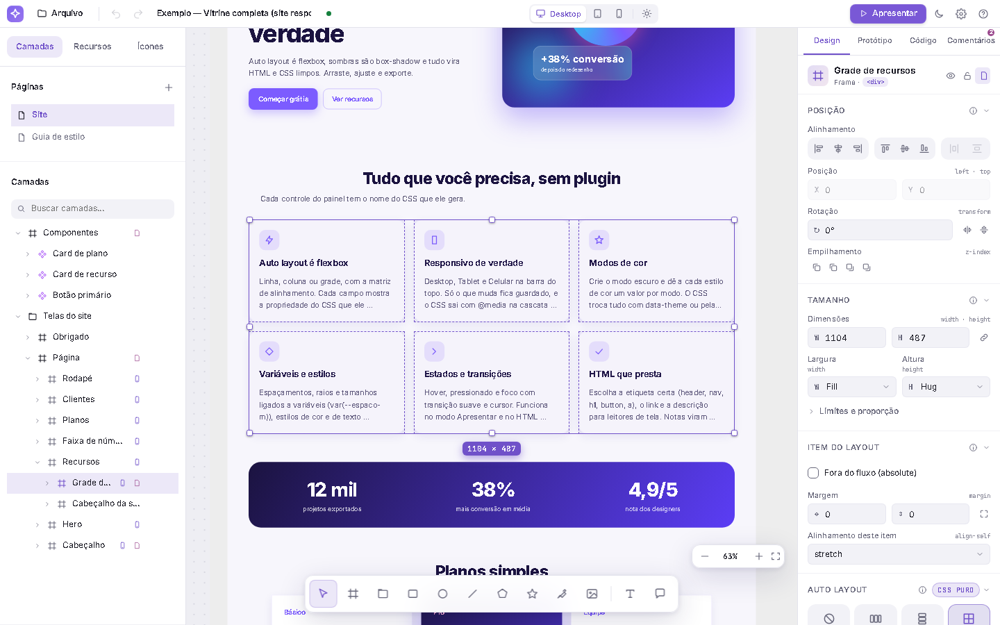
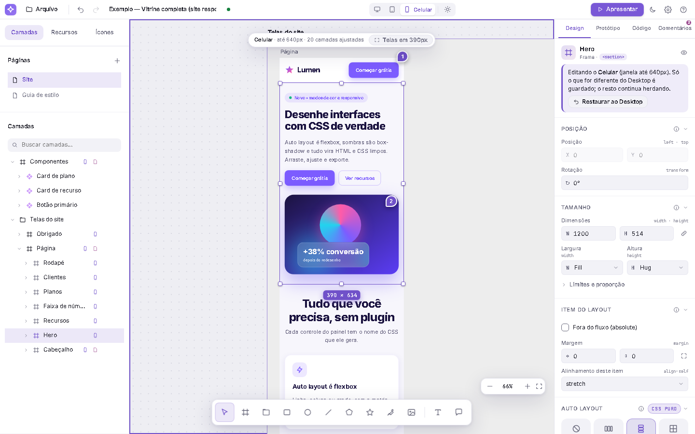
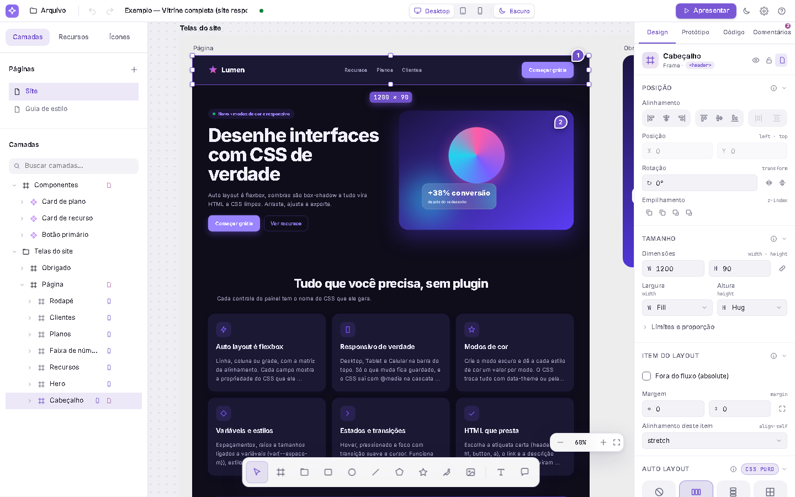
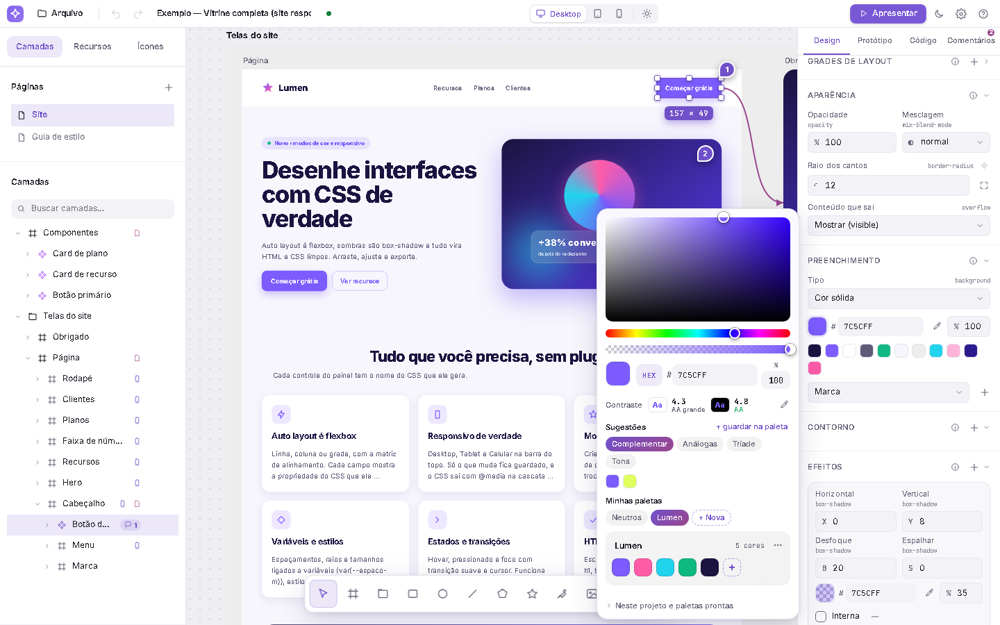
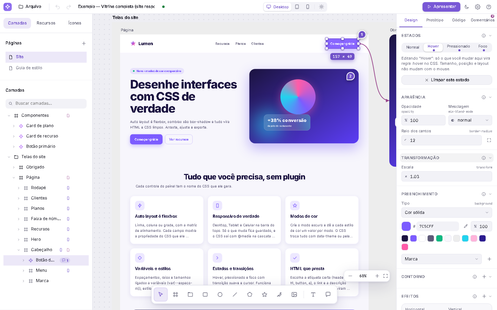
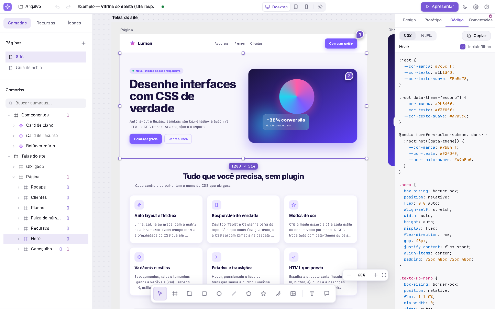
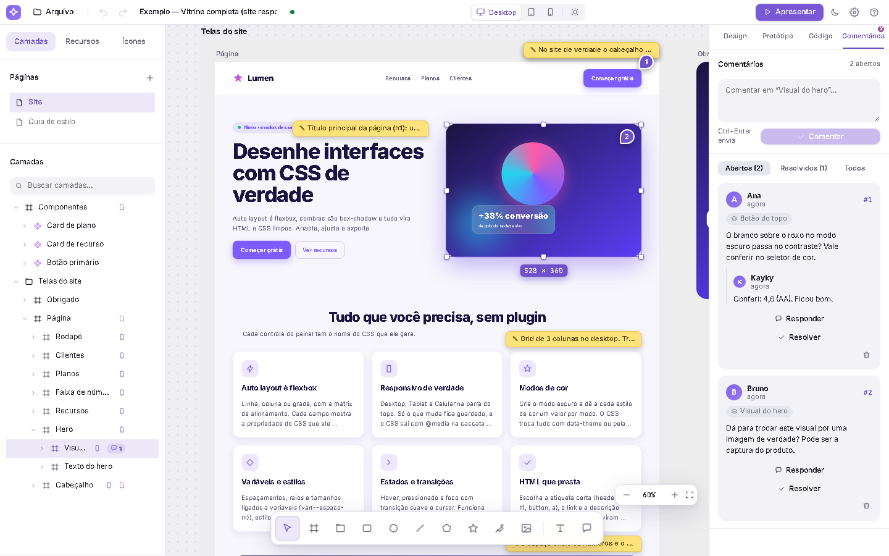
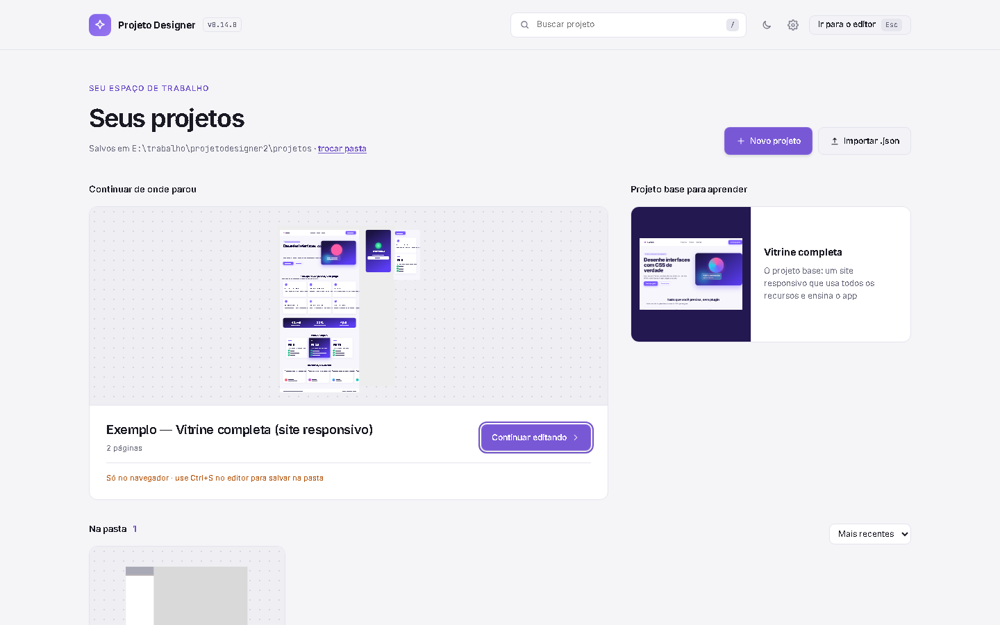

# Projeto Designer

**O editor de design onde o canvas é CSS de verdade.** Desenhe telas como no Figma, mas cada camada é um elemento HTML estilizado pelo próprio navegador: o que você vê é exatamente o que o CSS faz, o painel de código mostra o CSS real e "auto layout" não é imitação, é `display: flex` e `display: grid`. Feito só com JavaScript, roda no seu computador, sem conta e sem build.


> **Em uma frase:** desenhe um site, troque para Tablet e Celular, crie o modo escuro, e exporte o HTML e o CSS prontos para publicar.

`v0.15.1` · JavaScript puro (módulos ES) · sem dependências para rodar · 162 testes unitários + 28 suítes de navegador

---

## Por que ele existe

Ferramentas de design desenham *imagens* de interface; depois alguém reescreve tudo em CSS. Aqui não há essa tradução:

- **O canvas é o navegador.** Cada camada é um `<div>` real. Margem, sombra, flexbox, grade e `@media` funcionam do jeito que funcionam na web, porque são a web.
- **Cada campo tem o nome do CSS.** `gap`, `padding`, `justify-content`, `mix-blend-mode`, `border-radius`... usar o painel ensina CSS sem você perceber, e o código exportado bate com o que está escrito ali.
- **Do desenho ao site.** Etiquetas HTML semânticas (`header`, `nav`, `h1`, `a`, `button`), responsividade com `@media`, modo escuro com variáveis de CSS, estados `:hover` e `:focus-visible`: tudo sai no HTML e no CSS exportados.
- **Seu, no seu computador.** Os projetos são arquivos `.json` numa pasta sua (dá para pôr no Google Drive ou Dropbox), com versões antigas guardadas. Sem login, sem nuvem.

---

## Um site inteiro, de ponta a ponta

O app abre com a **Vitrine completa**: uma landing page responsiva (a fictícia "Lumen") que usa quase tudo que o editor faz. É o projeto base para aprender mexendo.

| | |
|---|---|
|  |  |
| **Auto layout é CSS.** Flexbox em linha e coluna, grade de 3 colunas, matriz de alinhamento, `fill`/`hug`, limites e proporção. | **Responsivo de verdade.** Troque para Celular na barra do topo: a grade vira 1 coluna, o hero empilha, o menu some. Só a diferença fica guardada e o CSS sai com `@media`. |
|  |  |
| **Modos de cor.** Cada estilo de cor ganha um valor por modo; o CSS troca tudo com `data-theme` ou pela preferência do sistema. | **Seletor de cor com paletas.** HEX/RGB/HSL, opacidade, contraste WCAG, sugestões de harmonia e paletas suas, criadas e gerenciadas ali mesmo. |
|  |  |
| **Estados e transições.** Edite hover, pressionado e foco como se fossem outra versão da camada; vira `.botao:hover` no CSS. | **Código real.** A aba Código mostra o HTML e o CSS da seleção, com variáveis, `@media` e comentários das suas notas. |
|  |  |
| **Notas e comentários.** Notas são post-its que documentam para que serve a camada (e viram comentário no código); comentários são conversa, com respostas e "resolver". | **Página inicial.** Seus projetos da pasta com miniaturas, busca e versões, mais o projeto base para aprender. |

---

## O que dá para fazer

**Desenhar e organizar**
- Frames, seções, retângulos, elipses, linhas, polígonos, estrelas, texto, imagens e a **caneta** com curvas de Bézier (dá para desenhar os próprios ícones SVG, ou importar SVG do Figma e do Illustrator).
- Páginas, camadas com busca, grupos, máscaras, réguas e guias (`Ctrl+R`), grades de layout, alinhar e distribuir, desfazer até 200 passos.

**Layout em CSS**
- **Flexbox e CSS Grid** com `gap`, `padding`, `justify-content`, `align-items`, `flex-wrap`, colunas e linhas, trilhas personalizadas (`repeat(auto-fit, minmax(...))`) e itens que ocupam várias células.
- Tamanho **fixo, ajustado ao conteúdo ou preenchendo** o espaço; `min`/`max`, `aspect-ratio`, `margin`, posição absoluta, restrições e largura fluida na tela raiz.

**Responsivo**
- **Desktop, Tablet (≤ 1024px) e Celular (≤ 640px)**: o design inteiro aparece naquela largura e você edita só o que muda; o CSS sai com `@media` em cascata. Ocultar uma camada por largura, "Telas em 390px" e "Restaurar ao Desktop".

**Cores e tokens de design**
- **Estilos de cor** e **de texto** compartilhados, **modos de cor** (claro/escuro) e **variáveis de tamanho** (`var(--espaco-m)`) ligadas a `gap`, `padding`, `border-radius` e `font-size`.
- **Paletas próprias** salvas no navegador, com cores recentes, harmonias e contraste.

**Aparência**
- Gradientes linear, radial e **cônico**, imagens de fundo, contorno por lado, várias sombras, `blur`, **vidro** (`backdrop-filter`), filtros de cor, `mix-blend-mode`, texto com limite de linhas e fontes do **Google Fonts**.
- **Estados** (hover, pressionado, foco) com `transition` e `cursor`.

**Do design ao código**
- Painel **Código** (HTML + CSS), copiar CSS, exportar **HTML** completo, **SVG** e **PNG**.
- **HTML semântico**: escolha a etiqueta, o link (`href`) e a descrição de acessibilidade (`aria-label`) de cada camada.

**IA e inspeção**
- **Assistente de IA** dentro do editor: peça "deixa este botão com cantos de 12px" ou "revisa o CSS deste card". Funciona com **OpenAI, NVIDIA NIM** ou uma IA gratuita no seu PC (**Ollama**), com a **sua** chave, e **toda alteração pede a sua permissão** antes (e sai com `Ctrl+Z`). O que a IA sabe e como ela trabalha está em [`docs/AGENTE.md`](docs/AGENTE.md), que você pode editar.
- **MCP**: o Claude Code, o Codex ou o Claude Desktop leem e alteram o design aberto, sem limite de chamadas (é tudo local).
- **Inspecionar** (`I`), como o F12 do navegador: passe o mouse e veja a etiqueta HTML, a classe, o tamanho, o *box model* (margem, padding e conteúdo coloridos), o contorno de cada elemento de dentro e, num grid, as linhas das colunas e linhas com os `gap` hachurados.

**Reaproveitar e apresentar**
- **Componentes** com instâncias (sobrescritas de texto, cor e tamanho), ícones do Material Symbols e **protótipo** clicável com transições, apresentado em tela cheia (`Ctrl+Alt+Enter`).
- **Notas** e **comentários** nas camadas.

---

## Começando em 3 minutos

Você precisa do **Node.js 18+** e de um navegador atual. Para usar o app não há nada para instalar.

```bash
git clone https://github.com/Kaykygnb/projetodesigner2.git
cd projetodesigner2
npm start
```

Abra **http://localhost:5173**. O app abre com a Vitrine completa: clique em uma camada, troque a largura no topo, crie o modo escuro, veja a aba **Código** e exporte o HTML.

- **Onde fica meu trabalho?** `Ctrl+S` dá um nome ao projeto e o grava na pasta `projetos/` (troque em **Configurações**, `Ctrl+,`); daí em diante salva sozinho, com versões antigas. Além disso, sempre há uma cópia no navegador.
- **Sem Node?** Qualquer servidor de arquivos estáticos serve (por exemplo `python3 -m http.server`); sem o `server.js` o projeto fica só no navegador e `Ctrl+S` baixa um `.json`. Também dá para publicar no GitHub Pages.
- **Por que um servidor?** Módulos ES não carregam via `file://`, e o `server.js` roda **na sua máquina** (só aceita `localhost`) para poder gravar a pasta.

### Atalhos para começar

| | |
|---|---|
| `F` frame · `R` retângulo · `E` elipse · `T` texto · `P` caneta | Desenhar |
| `Shift+A` | Ligar o auto layout |
| `Ctrl+R` | Réguas |
| `Ctrl+Z` / `Ctrl+Shift+Z` | Desfazer / refazer |
| `C` | Comentar |
| `I` | Inspecionar (como o F12) |
| `Ctrl+Alt+K` | Criar componente |
| `Ctrl+Alt+Enter` | Apresentar o protótipo |
| `?` | Todos os atalhos |

---

## IA: Assistente e MCP

**Assistente** (botão ✦ no topo): abra **Configurações → Assistente de IA e MCP**, escolha o **provedor**, cole a chave e clique em **Ver modelos** para escolher o modelo da sua conta (isso também testa a chave). Cada provedor guarda a própria chave, só no seu computador (no arquivo de configuração do servidor); ela nunca vai para o projeto nem volta ao navegador.

| Provedor | Endereço | Chave |
|---|---|---|
| OpenAI | `https://api.openai.com/v1` | `sk-...` em platform.openai.com/api-keys |
| **NVIDIA NIM** | `https://integrate.api.nvidia.com/v1` | `nvapi-...` em build.nvidia.com. Escolha um modelo que aceite ferramentas (*tool calling*) |
| Ollama (grátis, no seu PC) | `http://localhost:11434/v1` | sem chave; baixe um modelo com ferramentas (`ollama pull qwen2.5:7b`) |
| Outro compatível | o endereço dele | a chave dele |

As chaves também podem vir das variáveis de ambiente `OPENAI_API_KEY` e `NVIDIA_API_KEY`. As **instruções da IA** (quem ela é, o que pode fazer, como a ferramenta funciona, como trabalhar) ficam em [`docs/AGENTE.md`](docs/AGENTE.md): edite à vontade, vale na próxima mensagem, tanto para o Assistente quanto para o MCP.

**MCP** (com `npm start` rodando e o editor aberto no navegador):

| Programa | Como ligar |
|---|---|
| Claude Code | `claude mcp add --transport http designer http://localhost:5173/mcp` |
| Codex | em `~/.codex/config.toml`: `[mcp_servers.designer]` com `command = "node"` e `args = ["/caminho/do/projeto/scripts/mcp.mjs"]` |
| Claude Desktop | Configurações → Desenvolvedor → Editar configuração → em `mcpServers`: `"designer": { "command": "node", "args": ["/caminho/do/projeto/scripts/mcp.mjs"] }` |

A IA tem 11 ferramentas: ler o projeto, uma camada, o código (HTML/CSS), a seleção, procurar camadas, selecionar, e alterar/criar/apagar/mover camadas e desfazer. **Cada alteração abre uma janela no editor** ("Claude Code quer alterar “Card”: padding") com *Permitir*, *Permitir tudo nesta sessão* ou *Recusar*. O ChatGPT do site (chatgpt.com) só aceita MCP pela internet, então ainda não conecta.

---

## Como funciona por dentro

Toda camada é um objeto simples; **uma única função, `nodeStyle()` (`src/css.js`), transforma a camada em CSS** e alimenta o canvas, o painel de código, o HTML exportado e o modo Apresentar. Por isso o editor nunca "mente" sobre o resultado. As mudanças passam por `store.update()` e `store.commit()` (histórico), a lógica sem tela mora em módulos puros testados no Node, e o resto é interface em JavaScript puro.

Leia mais em [`docs/ARQUITETURA.md`](docs/ARQUITETURA.md), no [guia do código](docs/GUIA-DO-CODIGO.md) e na [referência gerada dos módulos](docs/REFERENCIA.md).

---

## Qualidade

- **162 testes unitários** (CSS, modelo, responsivo, modos de cor, variáveis, cores, paletas, SVG, salvamento, segurança do servidor): `npm test`.
- **28 suítes de navegador** com Playwright (mais de 500 verificações: **o HTML exportado é comparado camada por camada com o editor**, assistente de IA e MCP, desenhar, arrastar, caneta, componentes, protótipo, salvar na pasta, responsivo, modo escuro, seletor de cor...): `npm run test:e2e`.
- Desempenho: mover uma camada num projeto de 400 camadas fica em torno de 16 ms. Detalhes no [guia](docs/GUIA-COMPLETO.md#10-desempenho).

---

## O que ainda não tem

Sem enrolação, para você decidir se serve:

- **Edição em equipe:** um projeto é um arquivo; duas pessoas não editam juntas, e não há login (o app detecta conflito e para de gravar, mas não junta edições).
- **Variantes de componente**, operações booleanas em formas, mais de um preenchimento/contorno por camada e unidades além de `px` (`%`, `rem`, `calc()`).
- **Responsivo** com dois breakpoints fixos (1024 e 640px) e a mesma estrutura de camadas em todas as larguras.
- **Plugins** (a IA já entra pelo MCP e pelo Assistente; extensões próprias, não).

A lista completa, com os detalhes, está na [seção de limitações do guia](docs/GUIA-COMPLETO.md#11-limitações-leia-antes-de-usar-em-trabalho-sério). É uma base sólida para **uso individual**, prototipar, estudar CSS e entregar sites simples; para trabalho de cliente com várias pessoas ou ilustração complexa, o [Penpot](https://penpot.app) é a melhor escolha.

---

## Documentação

| Documento | Para quê |
|---|---|
| [`docs/GUIA-COMPLETO.md`](docs/GUIA-COMPLETO.md) | Tudo que o editor faz, onde o trabalho é salvo, atalhos, estrutura, testes e limitações |
| [`docs/ARQUITETURA.md`](docs/ARQUITETURA.md) | Como as peças se encaixam |
| [`docs/AGENTE.md`](docs/AGENTE.md) | As instruções da IA (Assistente e MCP): edite para mudar como ela trabalha |
| [`docs/GUIA-DO-CODIGO.md`](docs/GUIA-DO-CODIGO.md) · [`docs/REFERENCIA.md`](docs/REFERENCIA.md) | Para quem vai mexer no código |
| [`CHANGELOG.md`](CHANGELOG.md) | O que mudou em cada versão |
| [`tests/e2e/README.md`](tests/e2e/README.md) | Como rodar os testes de navegador |
| [`CONTRIBUTING.md`](CONTRIBUTING.md) | Como contribuir (e o padrão de commits) |

## Contribuindo e licença

Contribuições são bem-vindas: leia o [`CONTRIBUTING.md`](CONTRIBUTING.md). Regras de ouro: JavaScript puro e sem build; toda alteração no documento passa por `store.update()`; lógica sem DOM em módulos puros com teste; comentários explicam o *porquê*, em português.

**Inspiração:** a organização do produto (páginas, frames, camadas, auto layout, painel de código, componentes, protótipo) é inspirada no [Penpot](https://penpot.app) e no Figma. O código foi escrito do zero e não copia nenhum deles.

**Licença:** ainda não definida. Sem um arquivo `LICENSE`, o código fica com todos os direitos reservados por padrão, mesmo estando público; se quiser que outras pessoas possam usar, adicione uma licença (a [MIT](https://choosealicense.com/licenses/mit/) é a mais comum).
