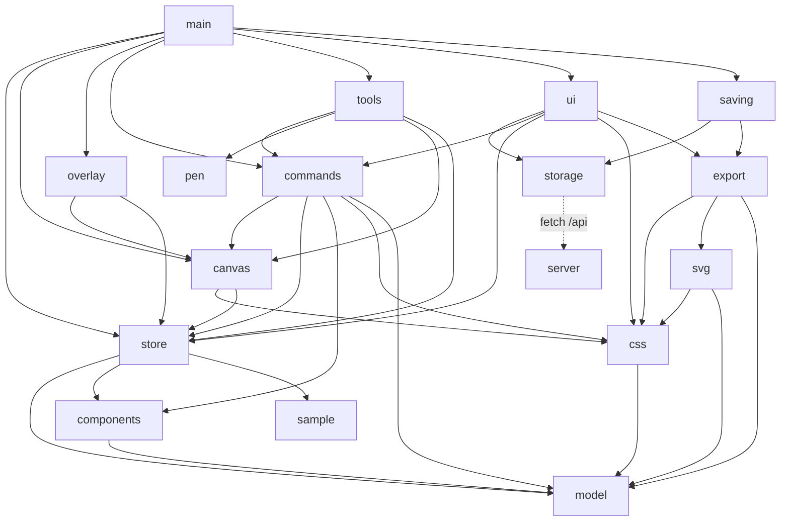

# Arquitetura do Projeto Designer

Este documento explica **como o app funciona por dentro** e **como estendê-lo**. Para uso, veja o [README](../README.md). O código também é comentado, arquivo por arquivo, em português.

## Índice

1. [Princípios](#1-princípios)
2. [Mapa dos módulos](#2-mapa-dos-módulos)
3. [Modelo de dados](#3-modelo-de-dados)
4. [O ciclo de uma mudança](#4-o-ciclo-de-uma-mudança)
5. [Renderização: do dado ao HTML](#5-renderização-do-dado-ao-html)
6. [Geração de CSS](#6-geração-de-css)
7. [Gestos do mouse](#7-gestos-do-mouse)
8. [Histórico e salvamento](#8-histórico-e-salvamento)
9. [Componentes e estilos](#9-componentes-e-estilos)
10. [Exportação](#10-exportação)
11. [Desempenho](#11-desempenho)
12. [Como estender](#12-como-estender)
13. [Decisões técnicas e armadilhas](#13-decisões-técnicas-e-armadilhas)

---

## 1. Princípios

1. **O canvas é DOM + CSS.** Cada camada é um `<div>` estilizado pelo navegador. Não há canvas 2D nem WebGL para desenhar o design. Consequência: flexbox, grid, sombras, gradientes, blur e tipografia funcionam "de graça" e são idênticos ao que será exportado.
2. **Uma fonte da verdade.** O documento vive no `store`. A interface é uma função do estado; ninguém guarda cópia própria.
3. **Dados simples.** O documento é só objetos, arrays, strings e números. Dá para `JSON.stringify`, comparar, testar no Node e gravar histórico.
4. **Módulos puros onde der.** Tudo que não precisa de DOM (`model`, `css`, `components`, `svg`) roda no Node e tem teste unitário.
5. **Sem build, sem dependências.** JavaScript em módulos ES carregados direto pelo navegador.
6. **O navegador faz o layout.** Em auto layout, as posições vêm do motor CSS; o editor as *lê* do DOM.

## 2. Mapa dos módulos

| Arquivo | Responsabilidade | Puro (sem DOM)? |
|---|---|---|
| `model.js` | Formato do documento, `createNode`, árvore (`walk`, `cloneNode`), grupos (`fitGroups`), constraints, `resizeNode` | ✅ |
| `css.js` | `nodeStyle` (camada→CSS), `generateCode` (HTML+CSS), vetores SVG, máscaras | ✅ |
| `components.js` | Instâncias com sobrescritas; estilos de cor/texto compartilhados | ✅ |
| `svg.js` | Exportação SVG vetorial | ✅ |
| `store.js` | Estado, `update`/`commit`, histórico, índice id→camada, **quando** salvar (debounce), eventos | ✅ (recebe `persist` pronto) |
| `storage.js` | **Como** gravar: IndexedDB (com migração do `localStorage` antigo), preferências e cliente da API da pasta | — |
| `saving.js` | **Regras** de salvamento: pasta x navegador, conflito, servidor desligado, reconciliação ao abrir; miniaturas, renomear, duplicar | — |
| `svgimport.js` | Importa SVG como vetores editáveis: lê `d` (M L H V C S Q T A Z), formas, `transform`, `viewBox`, estilos herdados, `<style>` simples, gradientes, `<use>` | ✅ (geometria) |
| `fonts.js` | Google Fonts: lista embutida, carregamento sob demanda (`ensureFonts`), prévia só com as letras do nome, URL do `<link>` | ✅ (exceto carregar) |
| `data/*.js` | Listas geradas por `scripts/gerar-listas-google.mjs`: fontes (nome, categoria, pesos) e nomes dos ícones | ✅ |
| `thumbnail.js` | Miniatura SVG da página aberta (reaproveita `svg.js` medindo o DOM do canvas) | — |
| `canvas.js` | Renderiza o documento em DOM; pan/zoom; geometria (`originOf`, `aabb`, `worldBox`) | — |
| `overlay.js` | Seleção, alças, guias, grades, medidas, setas do protótipo | — |
| `tools.js` | Todos os gestos do mouse e atalhos de teclado | — |
| `commands.js` | Operações sobre a árvore: agrupar, duplicar, alinhar, auto layout, componentes, vetores | — |
| `pen.js` | Ferramenta caneta e edição de pontos | — |
| `rulers.js` | Réguas e criação de guias | — |
| `present.js` | Modo Apresentar | — |
| `export.js` | Baixar PNG/SVG/HTML/projeto | — |
| `sample.js` | Dois projetos de exemplo | ✅ |
| `ui/*.js` | Painéis: camadas, propriedades, código, recursos, protótipo; **página inicial** (`home.js`); menus e janelas modais (`openModal`, `ask`, `askText`), Configurações, Projetos na pasta; ícones e componentes de formulário | — |
| `server.js` (raiz) | Entrega o app e expõe a API `/api` que grava os projetos na pasta | Node.js |
| `main.js` | Monta tudo na ordem certa | — |

**Dependências (setas = "usa")**



## 3. Modelo de dados

### Documento
```js
{
  version: 1,
  name: 'Sem título',
  pages:  [ Página ],
  assets: { [assetId]: 'data:image/png;base64,...' },   // imagens ficam FORA das páginas
  styles: { colors: [Estilo de cor], texts: [Estilo de texto] }
}
```
As imagens ficam em `assets` (e não dentro das camadas) para o **histórico não carregar megabytes** em cada "foto".

### Página
```js
{ id, name, children: [Camada], guides: [{ axis: 'x'|'y', pos: number }] }
```

### Camada (nó)
Todo nó tem os campos abaixo; cada tipo acrescenta os seus.

| Campo | Tipo | Significado |
|---|---|---|
| `id`, `type`, `name` | string | `type`: `frame`, `rect`, `ellipse`, `text`, `group`, `line`, `path` |
| `x`, `y`, `w`, `h` | number | Posição relativa ao **pai** (sem rotação) e tamanho. Em auto layout `x/y` são ignorados e `w/h` valem quando o tamanho é `fixed` |
| `rotation` | graus | Gira em torno do centro |
| `visible`, `locked` | bool | Oculta (`display:none`) / não clicável |
| `opacity`, `blend` | number, string | `opacity` e `mix-blend-mode` |
| `fill` | objeto | `type: none\|solid\|linear\|radial\|image` + dados de **todos** os tipos (assim trocar de tipo não perde valores) |
| `stroke` | objeto\|null | `{ color, opacity, width, style, position }` → `outline` |
| `radius` | `[tl,tr,br,bl]` | `border-radius` |
| `shadows` | lista | `{ x, y, blur, spread, color, opacity, inset }` |
| `blur`, `bgBlur` | number | `filter: blur` / `backdrop-filter: blur` |
| `sizeX`, `sizeY` | `fixed\|hug\|fill` | Como a camada calcula o tamanho |
| `absolute` | bool | Ignora o auto layout do pai |
| `alignSelf` | string | `align-self` do item |
| `constraints` | `{h, v}` | Reação ao redimensionar o frame pai (sem auto layout) |
| `colSpan`, `rowSpan` | number | Itens de grid (`span N`) |
| `flipX`, `flipY`, `lockRatio` | bool | Espelhar; travar proporção |
| `interactions` | lista | Protótipo: `{ trigger, action, target, transition, url }` |

Campos por tipo:
- **frame**: `clip`, `layout`, `grids`, `children`, e opcionalmente `component: true`, `flowStart: true`.
- **group**: `children`. A caixa é sempre recalculada a partir dos filhos (`fitGroups`).
- **text**: `text`, `fontFamily`, `fontSize`, `fontWeight`, `fontStyle`, `lineHeight` (multiplicador), `letterSpacing`, `textAlign`, `textDecoration`, `textTransform`, `textVAlign`, `textStyleId`.
- **line**: usa `stroke` (a caixa tem ≥12 px de altura só para facilitar o clique).
- **path**: `points`, `closed`, `vw`, `vh`. Cada ponto é `{ x, y, hin, hout }` (alças de Bézier; `null` = ponto de canto) num espaço próprio `vw×vh`; `w/h` só esticam esse espaço.
- Máscara: uma camada filha de um grupo com `isMask: true`.
- Instância: `instanceOf` (id do principal) e `base` (foto da última sincronização); filhos têm `srcId`.

### Layout de um frame
```js
layout: {
  mode: 'none' | 'row' | 'column' | 'grid',
  gap, colGap, rowGap,       // flex usa gap; grid usa colGap/rowGap
  cols, rows,                // grid (rows 0 = automático)
  padding: [topo, direita, baixo, esquerda],
  justify, align,            // justify-content/justify-items e align-items
  wrap
}
```

O formato de arquivo `.designer.json` é exatamente o documento acima serializado.

## 4. O ciclo de uma mudança

```text
gesto/painel ──► store.update(fn)  ──► muda os objetos ──► emit('doc')
                       │                                       │
                       │                    ┌──────────────────┴──────────────────┐
                       │                    ▼ síncrono                            ▼ 1x por frame (rAF)
                       │            canvas.render()                      painéis (camadas, propriedades,
                       │            overlay.render()                     código...) se atualizam
                       ▼
        store.commit()  (ao FIM do gesto)
          1. fitGroups      → recalcula a caixa dos grupos
          2. syncInstances  → propaga mudanças dos componentes
          3. syncStyles     → propaga mudanças dos estilos
          4. foto no histórico (se algo mudou) + salvamento agendado
```

Pontos importantes:

- **Dois canais de eventos.** `subscribeSync` (canvas, overlay) é imediato, porque durante um arrasto precisamos medir o DOM *já atualizado*. `subscribe` (painéis) é agrupado por frame, porque reconstruí-los a cada movimento do mouse seria caro.
- **`update(fn, { structural })`.** `structural: true` (padrão) invalida o índice id→camada. Mover, girar ou digitar um número só muda *valores*: use `structural: false` e o índice continua válido. Foi isso que tornou o arrasto fluido.
- **`update` sem `commit`** durante gestos; **um** `commit` ao soltar o mouse.

## 5. Renderização: do dado ao HTML

`canvas.js` mantém um mapa `id → elemento`. Em cada render, `syncNode` percorre a árvore:

1. cria o `<div>` se não existe;
2. calcula `nodeStyle(...)` e só reaplica se o texto do CSS mudou (cache em `el._css`; ler `style.cssText` seria caro);
3. atualiza texto (exceto durante a edição, quando o usuário digita direto no elemento) e SVG de vetores;
4. garante a ordem entre irmãos (ordem do array = ordem z).

Depois, `measureBack` lê `offsetWidth/Height` das camadas `hug`/`fill` e grava em `node.w/h`, para o painel mostrar o tamanho real. Não entra no histórico (é dado derivado).

**Geometria** (`canvas.js`):
- `originOf(id)`: soma `offsetLeft/Top` pela cadeia de pais — ignora `transform`, então funciona com rotação e zoom;
- `aabb(id)`: retângulo envolvente via `getBoundingClientRect` convertido para o mundo — considera rotação;
- `worldBox(id)`: centro, tamanho e rotação própria — o overlay usa para desenhar a seleção girada.

O "mundo" é um elemento com `transform: translate(x, y) scale(zoom)`; pan e zoom são só esse transform.

## 6. Geração de CSS

`nodeStyle(node, parent, assets, opts)` decide o modo de posicionamento:

| Situação | CSS |
|---|---|
| Raiz da exportação | `position: relative` + `width/height` |
| Item de **grid** (pai em grid, não absoluto) | `position: relative`, `justify-self`/`align-self`, `grid-column: span N` |
| Item de **flex** | `position: relative`, `flex: 1 1 0%` (se `fill` no eixo principal) ou `0 0 auto`, `align-self: stretch` (se `fill` no cruzado) |
| Camada livre | `position: absolute`, `left`, `top`; `hug` na largura vira `max-content` |

Em seguida acrescenta o layout do próprio frame (`display: flex|grid`...), tipografia, fundo, `border-radius`, contorno (`outline` + `outline-offset`), efeitos e `transform`.

## 7. Gestos do mouse

`tools.js` é uma máquina de estados simples. `drag` guarda o gesto atual:

```text
pointerdown → decide o gesto (pan | move | resize | rotate | draw | marquee | pen | guide) e guarda o ESTADO INICIAL
pointermove → recalcula SEMPRE a partir do estado inicial (nunca acumula) e atualiza o documento ao vivo
pointerup   → store.commit() uma vez
```

**Mover.** Posição final = *origem inicial no mundo + deslocamento do ponteiro − origem do pai atual*. Por usar coordenadas de mundo, continua certa mesmo quando a camada troca de pai no meio do arrasto (passa sobre outro frame; `commands.reparent` mantém a posição visual). O *snap* compara bordas e centros com os irmãos, o pai e as guias (limite de 6 px de tela). Em auto layout, mover vira **reordenar**: `flowReorder` acha o irmão com centro mais próximo do ponteiro e decide antes/depois.

**Redimensionar** (uma camada, possivelmente girada). Converte o deslocamento do mouse para os eixos locais da camada (rotação inversa), calcula `w/h` novos, e então recalcula `x/y` de modo que o ponto **âncora** (o lado oposto à alça, ou o centro com `Alt`) continue no mesmo lugar do mundo. Para várias camadas, escala o conjunto pela caixa envolvente.

**Rotacionar.** `rotação = rotação inicial + (ângulo atual − ângulo inicial)` em torno do centro, em px de tela.

## 8. Histórico e salvamento

### Histórico
- O histórico guarda até **200 fotos** JSON de `{ name, pages, styles }`; desfazer/refazer só movem um ponteiro e restauram a foto.
- `assets` não entra na foto (só cresce), por isso a foto é pequena.

### Salvamento: quem faz o quê
```
store.commit() ──► scheduleSave() ──(400 ms sem mudanças)──► save() ──► persist(record)   [saving.js]
                                                                          ├─ 1. pasta: PUT /api/projects/<arquivo>   (se ligado)
                                                                          └─ 2. navegador: IndexedDB                 (sempre)
```
- **`store.js`** decide *quando*: debounce de 400 ms, **uma gravação por vez** (se mudar durante a gravação, grava de novo no fim) e uma flag `dirty` para não gravar sem mudanças (gravar à toa ao fechar a aba causava "conflito" falso).
- **`saving.js`** decide *onde*. A pasta é gravada **antes** do navegador, para a cópia do navegador já guardar a data nova do arquivo.
- **`storage.js`** sabe *como*: IndexedDB (sem o limite de ~5 MB do `localStorage`; se o IndexedDB não existir, cai para o `localStorage`), preferências e a API.
- Ao fechar/esconder a aba (`visibilitychange`/`pagehide`) chamamos `store.saveNow()`. O IndexedDB é assíncrono e pode não terminar dentro do `beforeunload`; por isso existe a reconciliação abaixo.

### O vínculo com o arquivo (`ui.link`)
`{ file: 'meu-app.json', modified: <mtime do disco>, synced: true|false, conflict?: true }`, gravado junto com a cópia do navegador.
- `modified` vai no cabeçalho `X-Base-Modified`; se o arquivo do disco tiver outra data, o servidor responde **409** e nada é sobrescrito (`conflict = true`, o app para de gravar nele até você decidir com `Ctrl+S`).
- `synced` diz se o navegador tem mudanças que ainda não foram para a pasta (servidor desligado, conflito, auto-salvar desligado).
- Projetos novos, exemplos, importados e versões antigas abrem **sem** vínculo: nunca sobrescrevem um arquivo sem você pedir.

### Reconciliação ao abrir (`saving.reconcile`)
Compara, sem usar relógios, *"o arquivo mudou desde a última vez?"* com *"o navegador está à frente?"*:

| | navegador em dia (`synced`) | navegador à frente |
|---|---|---|
| **arquivo igual** | nada a fazer | grava na pasta |
| **arquivo mudou** | abre o do disco | conflito (mantém o do navegador) |

### API do servidor
`GET /api/status` · `PUT /api/config {folder, keepVersions}` · `GET /api/projects` · `GET|PUT /api/projects/<arquivo>` · `GET /api/projects/<arquivo>/versions[/<id>]` · `GET|PUT /api/projects/<arquivo>/thumb` · `POST /api/projects/<arquivo>/rename {to}`.

### Miniaturas
Depois de cada gravação na pasta (no máximo 1 a cada 15 s por arquivo, quando o navegador fica ocioso), `saving.js` chama `thumbnail.js`, que monta um "grupo de mentira" com as camadas da raiz da página aberta e converte com `svg.js` (posições medidas no DOM, como no exportar SVG). Imagens grandes viram um retângulo cinza para a miniatura ficar leve. O servidor guarda em `.miniaturas/` e serve com uma `Content-Security-Policy` que impede scripts dentro do SVG.

### Trocar de projeto (`confirmReplace` em main.js)
Toda troca (abrir da pasta, Recentes, página inicial, novo, exemplo, importar, versão antiga) passa por `confirmReplace`: sem pergunta se o projeto está gravado na pasta ou é um exemplo/em branco não editado (`ui.pristine`); senão, `ask()` oferece salvar antes, descartar ou cancelar. O navegador guarda **um** projeto, então trocar sem perguntar apagaria o único lugar onde o rascunho existe. Detalhes e proteções (Host/Origin/Content-Type, nomes de arquivo, gravação atômica, versões a cada 10 min) no cabeçalho de [`server.js`](../server.js); testes em [`tests/api.test.js`](../tests/api.test.js).

### Preferências
Largura dos painéis, auto-salvar na pasta e modo da roda do mouse ficam em outra chave do `localStorage` (`projeto-designer:prefs`), para não "sujar" o documento.

## 9. Componentes e estilos

**Componente principal**: camada com `component: true`. **Instância**: cópia com `instanceOf` e `base`.

`syncOne(instância, principal)`, a cada commit:

1. **Descobre as sobrescritas**: `diff(instância atual, instância.base)` — o que difere da foto é o que o usuário mudou.
2. **Reconstrói** os filhos como cópia do principal, com ids estáveis `<idInstância>~<idOriginal>` (e `srcId`) — ids estáveis preservam seleção e histórico.
3. **Reaplica** as sobrescritas da raiz (e as constraints, se a instância foi redimensionada).
4. **Tira a nova foto** `base` e reaplica as sobrescritas dos filhos.

Se o principal sumiu (ou há ciclo), a instância vira uma camada comum.

**Estilos** (`doc.styles`): camadas ligadas (`fill.styleId`, `textStyleId`) recebem os valores do estilo a cada commit; se o estilo for apagado, o vínculo cai e os valores ficam.

## 10. Exportação

| Formato | Técnica |
|---|---|
| **HTML** | `generateCode` produz `<div>`/`<p>` com classes legíveis + regras CSS; `exportHtml` embrulha numa página. |
| **PNG** | Monta o HTML+CSS, embrulha num SVG com `<foreignObject>`, carrega como imagem e desenha num `<canvas>` na escala pedida. Limitação: fontes da web não carregam dentro de imagem SVG. |
| **SVG** | `svg.js` **reescreve** a árvore como SVG (formas, `<text>`, gradientes, filtros, `clipPath`). A posição dos filhos vem de um callback (`boxOf`) que mede o DOM para respeitar flex/grid. |
| **Projeto** | `JSON.stringify(doc)` em `.designer.json`. |

## 11. Desempenho

O que mantém o arrasto a ~20 ms com 400 camadas (de 150 ms antes):

1. **Painel de camadas com assinatura**: só reconstrói a lista se algo *visível* mudou (ids, nomes, visibilidade, pastas abertas...). Mover uma camada não muda nada disso.
2. **`structural: false`** nas atualizações de valor: o índice `id → camada` não é refeito.
3. **Cache do CSS aplicado** (`el._css`): evita reler `style.cssText`.
4. **Sem consultas ao índice** no laço quente do render (o pai desce pela recursão).

Dica de diagnóstico: `node tests/e2e/desempenho.mjs 1000`.

## 12. Como estender

### Adicionar uma propriedade a todas as camadas
1. Valor padrão em `createNode` (`model.js`) — documentos antigos sem o campo devem continuar funcionando (use `?? padrão` ao ler).
2. Se afeta a aparência: traduza em `nodeStyle` (`css.js`) e, se for exportável, em `svg.js`.
3. Campo no painel (`ui/props.js`), usando `num/select/check` e `each(...)` para aplicar a todas as selecionadas.
4. Se deve poder ser sobrescrita em instâncias: acrescente em `OVERRIDE_PROPS` (`components.js`).
5. Teste em `tests/css.test.js` ou `tests/features.test.js`.

### Adicionar um tipo de camada
1. Rótulo em `TYPE_LABEL` e defaults em `createNode`.
2. `nodeStyle` (e `svg.js`) saberem desenhar; ícone em `ui/icons.js` (`nodeIcon`).
3. Se é desenhado com o mouse: ferramenta em `tools.js` (`DRAW_TOOLS`, `startDraw`) e botão em `main.js` (`TOOLS`).

### Adicionar um atalho
Em `tools.js`, no `keydown` (a ordem importa: do mais específico ao mais geral). Chame um **comando** de `commands.js`, não coloque lógica no atalho. Registre o atalho em `ui/menus.js` (`SHORTCUTS`) e no README.

### Adicionar um comando
Em `commands.js`: descubra o alvo (`topSelection()`), mude com `store.update(...)`, ajuste a seleção, `store.commit()`. Exponha no `return` e, se fizer sentido, no menu de contexto (`ui/menus.js`).

### Adicionar um painel
Função `createXPanel({ store, ... })` em `ui/`, devolvendo `{ el, render }`; assine o store e só renderize quando a aba estiver aberta; monte em `main.js`.

## 13. Decisões técnicas e armadilhas

- **`outline` em vez de `border` para contornos.** `outline` não altera o tamanho da caixa nem empurra vizinhos em auto layout, e segue o `border-radius` nos navegadores atuais.
- **`contentEditable = 'plaintext-only'`** na edição de texto: impede colar formatação; há *fallback* para `'true'`.
- **Pointer capture + `dblclick`.** Com `setPointerCapture`, o `dblclick` chega com alvo = viewport; por isso `tools.js` guarda o alvo real do último `pointerdown`.
- **`elementsFromPoint` ignorando o overlay.** Durante o arrasto, as alças da seleção ficam sob o cursor; sem filtrá-las, a detecção do "frame de destino" falhava.
- **`structural:false` é uma promessa.** Se sua `fn` inserir, remover ou reordenar camadas, **não** use — o índice ficaria desatualizado.
- **O índice usa `Map` por id.** Camadas de instância têm ids derivados (`<inst>~<orig>`); nunca assuma que um id é "só 8 caracteres".
- **`measureBack` escreve no modelo durante o render.** É intencional (dado derivado) e não passa por `update`; por isso não gera histórico nem eventos.
- **Imagens grandes são reduzidas** (1600 px) antes de entrar em `assets`: o projeto inteiro é regravado a cada mudança (navegador e pasta), então imagens enormes deixariam o salvamento lento.
- **Gravação atômica na pasta.** O servidor grava num arquivo temporário e renomeia; se a energia cair no meio, o projeto antigo continua inteiro.
- **Canvas "coberto" não reage.** Com a página inicial ou uma janela aberta, `tools.js` ignora teclado/copiar/colar (`covered()`) e o `#app` fica `inert`. Antes disso, `Delete` com o foco num botão de uma janela apagava camadas escondidas.
- **Container query no palco.** A barra de ferramentas (~480 px) e o zoom ficam no rodapé do palco; quando o **palco** fica estreito (< 900 px), o zoom sobe. A regra olha o palco e não a janela, então vale também ao alargar os painéis.
- **`Shift+A` interpreta a intenção** (`commands.toggleAutoLayout`): um retângulo sozinho vira frame (mesmo id); um grupo vira frame; na seleção de várias camadas, se a mais ao fundo é um retângulo que contém as outras, ele vira o FUNDO do frame (senão o flexbox poria fundo e itens lado a lado). `enableAutoLayout` deduz direção, gap, padding e alinhamento (centro/fim) e não transforma "espaço livre" em padding gigante.
- **Formas não nascem invisíveis.** `tools.js → contrastingFill` compara a cor padrão com a cor sob o cursor (`colorUnder`) e troca por um tom que contrasta quando o brilho fica parecido demais.
- **Vetores com vários contornos.** Um vetor tem o contorno principal (`points`, `closed`) e, opcionalmente, `contours: [{points, closed}]` e `fillRule: 'evenodd'`. É o que permite furos (ícones, letras) vindos de SVG. `css.js → nodePathData` junta tudo num `d`; o canvas, a máscara, o SVG exportado e `normalizePath` usam essa função. A caneta edita só o contorno principal.
- **Listas do Google embutidas, arquivos baixados na hora.** O catálogo (`fonts.google.com/metadata`) não libera acesso direto do navegador; por isso as listas ficam em `src/data/` (geradas por script) e só os ARQUIVOS são baixados: `fonts.googleapis.com` (CSS das fontes) e `fonts.gstatic.com` (SVG dos ícones), ambos com CORS liberado. Funciona até sem o servidor do app.
- **Sombras do Figma e fontes do Illustrator no importador.** `svgimport.js → shadowsOf` lê o padrão de filtro que o Figma exporta (feOffset → feGaussianBlur → [feMorphology] → feColorMatrix → feBlend, uma vez por sombra) e `<feDropShadow>`; a sombra vale para tudo dentro do elemento filtrado. Sombra interna não existe para vetores (o CSS `drop-shadow` é só externo) e é contada como ignorada. `resolveFontName` converte nomes PostScript ("OpenSans-SemiBoldItalic", "ArialMT") procurando o nome "compacto" (sem espaços) na lista do Google e do sistema. Exemplos reais de estrutura em `tests/fixtures/`.
- **Prévia de fonte com outro nome.** O seletor baixa só as letras do nome da fonte (`&text=`), mas injeta o CSS com a família renomeada (`Prévia X`): senão o navegador poderia usar esse arquivo "incompleto" no lugar da fonte de verdade.
- **Sem login no Google.** Integrar a API do Google Drive exigiria registrar o app no Google Cloud e fazer OAuth; apontar a pasta para dentro do Drive para computador dá o mesmo resultado sem nada disso.
