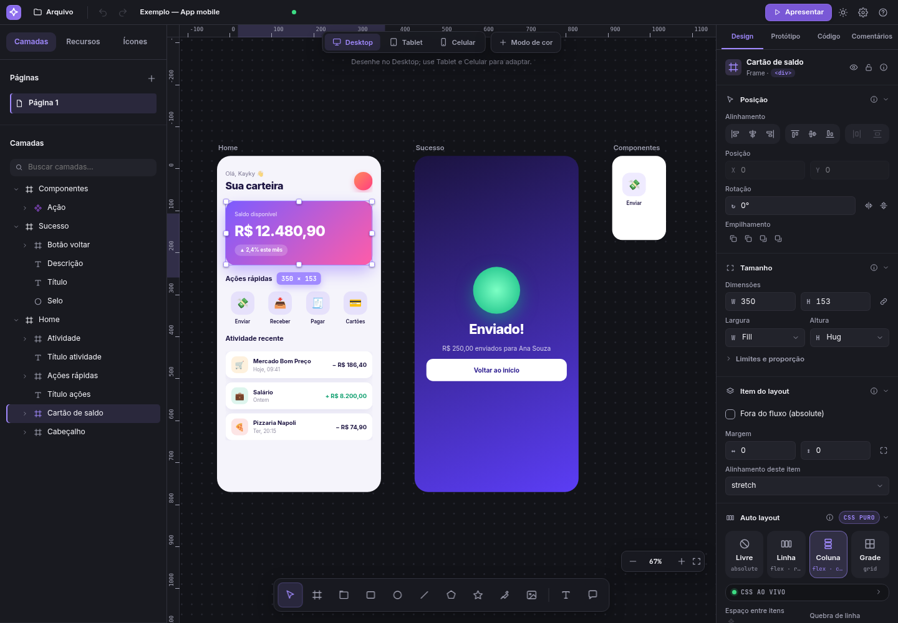

# Polimento visual da versão 0.13

Base: `release/v0.13.0-responsivo-modos-de-cor`, commit `9a147a9e22070efcba2513fd11d77f3f1ab47e8e`.

O trabalho mantém as ferramentas, os exemplos e o formato dos documentos existentes. As mudanças estão na interface: página inicial com o projeto atual em destaque e exemplos ao lado, prévias dos exemplos reais, controles mais discretos, cores com melhor contraste nos dois temas, hierarquia e espaçamento dos painéis e ferramentas mais compactas quando o palco fica estreito.

O editor ganhou um topo de **40 px**, antes 56 px, recuperando 16 px de altura para o canvas. Nome do documento, Arquivo e desfazer/refazer ficam agrupados à esquerda. O estado de salvamento aparece em um indicador com informação ao passar o mouse ou pelo leitor de tela; avisos e erros continuam mostrando o texto completo.

No painel direito, **Design, Protótipo, Código e Comentários** têm rótulos visíveis e uma linha indica a aba ativa. As propriedades têm espaçamento mais compacto. A Nota abre e fecha pelo ícone **i** da camada; o ícone fica destacado quando há uma anotação. As explicações de cada seção abrem pelo próprio **i**, em uma pequena janela que não desloca os campos. Clique fora, Escape ou o botão de fechar encerram a explicação. As seções continuam recolhíveis, e a Nota mantém o salvamento, o menu de contexto e a inclusão no código existentes.

A prévia do projeto foi ajustada para caber no card sem corte. A dica de Desktop, que não possui ações, deixa os eventos do mouse passarem para o canvas. Os controles de Tablet/Celular e suas ações continuam interativos.

## Capturas da aplicação rodando

Estas imagens foram capturadas no Chromium, com o app executado pelo servidor Node do repositório. Os documentos de exemplo permanecem os da versão original.

| Tela | Captura |
| --- | --- |
| Página inicial, tema escuro | [Abrir](screenshots/polimento-v0.13/01-inicial-escuro.png) |
| Página inicial, tema claro | [Abrir](screenshots/polimento-v0.13/02-inicial-claro.png) |
| Editor, tema escuro | [Abrir](screenshots/polimento-v0.13/03-editor-escuro.png) |
| Editor, tema claro | [Abrir](screenshots/polimento-v0.13/04-editor-claro.png) |
| Página inicial em 390 px | [Abrir](screenshots/polimento-v0.13/05-inicial-celular.png) |
| Informação aberta pelo i | [Abrir](screenshots/polimento-v0.13/06-editor-informacao.png) |
| Nota aberta pelo i da camada | [Abrir](screenshots/polimento-v0.13/07-editor-nota.png) |



## Validação

Ambiente: Linux, Node.js 24.19.0, Chromium 151 e Playwright 1.58.0.

- **136 testes unitários passaram.** Incluem CSS, modelo, responsividade, modos de cor, importação SVG, salvamento e segurança do servidor.
- **23 das 24 suítes de navegador passaram**, considerando a execução completa e a repetição dos testes afetados após os ajustes finais. Cobrem desenho, arrasto, texto, camadas, atalhos, propriedades, componentes, auto layout, grid, protótipo, exportação, persistência, arquivos e conflitos, SVG, ícones, fontes, comentários, notas, paletas, responsividade e modos/variáveis. A falha restante é a suíte de desempenho descrita abaixo.
- A nova suíte `editor-compacto.mjs` verifica topo de 40 px, estado de salvamento acessível, informações por clique e teclado, campos sem deslocamento, Escape, retorno do foco, proteção contra atalhos do canvas, edição e reabertura da Nota e as quatro abas. Confere também que consultar informações e trocar abas preserva o documento. Ela e `notas-paletas-painel.mjs` passaram após os ajustes finais.
- A suíte nova `layout-polido.mjs` verifica imagens válidas e contidas e ausência de rolagem horizontal na página inicial em **320, 390, 768, 1024 e 1440 px**, busca pelo teclado, Escape, ambos os temas e ferramentas/zoom sem sobreposição entre **900 e 1440 px**. Ela e a suíte da página inicial foram repetidas depois do último ajuste das imagens e passaram.
- Percurso adicional realizado por mouse e teclado, sem inserir documentos ou alterações pela API interna do editor: abrir um exemplo, selecionar uma camada, consultar Código, apresentar o protótipo, criar um projeto, desenhar frame e retângulo, alterar largura e cor, desfazer/refazer, salvar com Ctrl+S, exportar HTML e recarregar. **Todos os passos passaram**, incluindo verificação do JSON gravado e do HTML baixado. Nenhum erro de JavaScript ou console nesse percurso.

### Ressalva de desempenho

A suíte `desempenho.mjs` falhou no critério p95 ≤ 16 ms com 400 camadas: **16,9 ms** na execução completa do editor compacto. Na revisão anterior, mediu **23,2 ms** em execução isolada. A branch original, executada separadamente com as mesmas fontes externas carregadas, também excedeu o limite: **17,5 ms**. Essas medições variam entre execuções e não demonstram cumprimento da meta ou uma melhora de desempenho. O teste e seu limite foram preservados.

Não foram avaliados Firefox, Safari/WebKit, toque em dispositivo físico ou uso prolongado. A validação de 320–768 px refere-se à página inicial; o editor foi verificado em janelas de 900–1440 px.

### Recursos externos no ambiente de teste

O Chromium deste ambiente apresentou erro de confiança no certificado do proxy ao acessar Google Fonts e Material Symbols. Para testar esses fluxos, os pedidos aos dois domínios foram encaminhados por um adaptador de QA ao `curl`, usando o proxy e a autoridade certificadora configurados no ambiente, com TLS verificado. As respostas reais foram devolvidas ao navegador, sem substituir fontes, ícones ou respostas por mocks. Esse adaptador fica fora do código do aplicativo e não é necessário na execução local comum.

## Rodar localmente

```bash
npm ci
npm start
```

Abra `http://localhost:5173/`. Para verificar:

```bash
npx playwright install chromium
npm test
npm run test:e2e
```

Se já houver Chromium instalado, use `CHROMIUM_PATH` conforme o [guia dos testes](../tests/e2e/README.md). A suíte de desempenho conserva sua saída com falha quando ultrapassa 16 ms.
